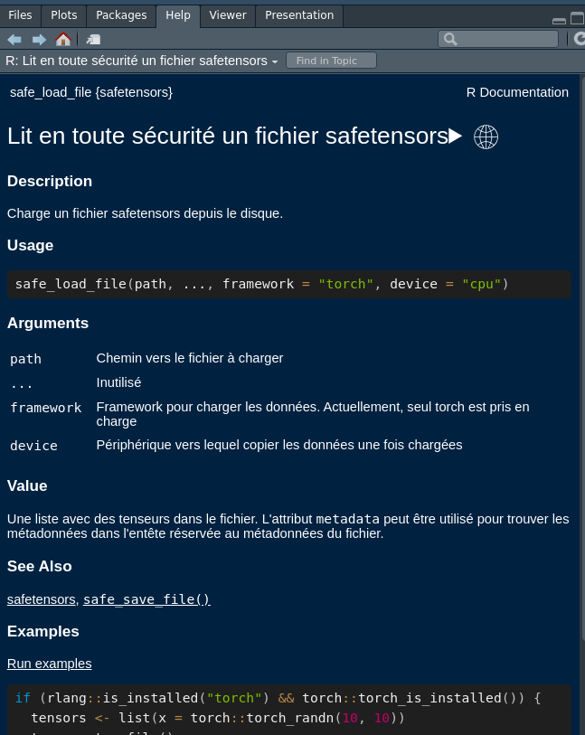

# safetensors.fr

<!-- badges: start -->

<!-- badges: end -->

Le paquet d'internationalisation de **{safetensors}** en français (fr)

## Installation

Vous pouvez installer la version de development de **{safetensors.fr}** depuis [GitHub](https://github.com/) via:

``` r
# install.packages("devtools")
devtools::install_github("eliocamp/rhelpi18n")
devtools::install_github("cregouby/safetensors.fr")
```

## Exemple

Voici comment utiliser {safetensors} avec l'aide en français :

``` r
# configure la session en langue française
Sys.setenv(LANGUAGE = "fr")

# charge la librairie safetensors en traduction française et {safetensors}
library(safetensors.fr)
library(safetensors)

# consulte l'aide normalement
?model_unigram
```


